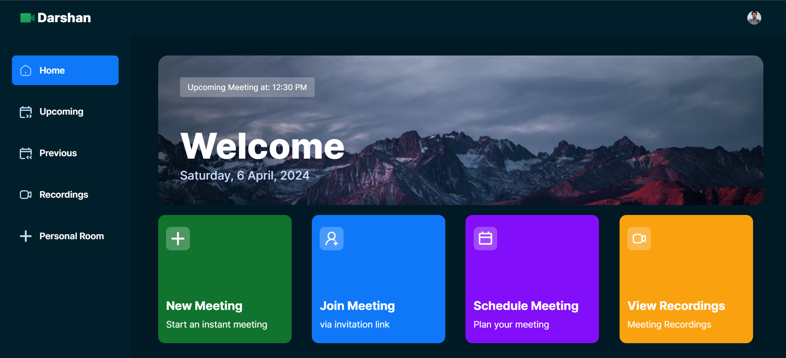

# Darshan : video calling app

This documentation provides an overview of the features and technologies used in the development of our professional enterprise-ready video conferencing application. Below you will find information on how to use the application, as well as details about the technologies and libraries utilized.

## Features

- **Instant Meeting**: Start a meeting instantly without any prior scheduling.
- **Join Meeting via Invitation Link**: Join meetings by simply clicking on an invitation link.
- **Schedule Meeting**: Schedule meetings for future dates and times.
- **View Meeting Recordings**: Access recordings of past meetings.

## Technologies Used

### Frontend

- **Typescript**: A statically typed superset of JavaScript that enhances code quality and maintainability.
- **Next.js@14**: A React framework for building server-side rendered and statically generated applications.
- **Tailwind CSS**: A utility-first CSS framework for creating custom designs quickly.
- **Stream-io**: A service for building scalable feeds and activity streams.
- **Shadcn-ui**: A UI library providing customizable React components.
- **Lucide-react**: A set of simply designed, yet fully customizable icons as React components.
- **Clerk-auth**: A user authentication library offering secure and customizable authentication flows.

## Usage

To start using the application, visit [darshan-iota.vercel.app](https://darshan-iota.vercel.app).

### Instant Meeting

1. Navigate to the homepage.
2. Click on the "Start Meeting" button.
3. Grant necessary permissions to access your camera and microphone if prompted.
4. Share the meeting link with other participants to join.

### Join Meeting via Invitation Link

1. Click on the invitation link provided by the meeting organizer.
2. Grant necessary permissions to access your camera and microphone if prompted.
3. You will be directed to the meeting room upon successful connection.

### Schedule Meeting

1. Go to the scheduling section of the application.
2. Choose the date and time for your meeting.
3. Fill in the meeting details and click on the "Schedule" button.
4. An invitation link will be generated, which you can share with participants.

### View Meeting Recordings

1. Access the recordings section of the application.
2. You will find a list of past meetings with their respective recordings.
3. Click on the recording you wish to view.

## Development

To set up the development environment locally, follow these steps:

1. Clone the repository from [GitHub](https://github.com/anirbansharma1996/darshan).
2. Navigate to the project directory.
3. Install dependencies using `npm install`.
4. Run the development server using `npm run dev`.

## Contributing

We welcome contributions from the community. If you find any bugs or have suggestions for improvements, please open an issue or submit a pull request on our GitHub repository.

